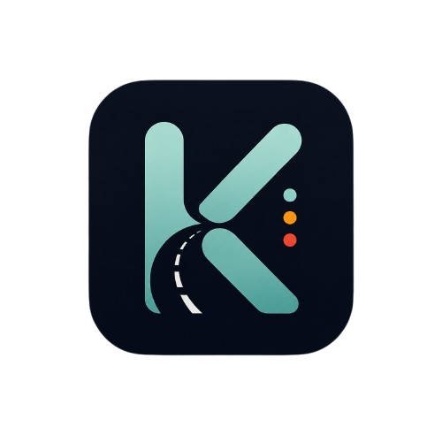

<div align="center">
  
  
  # Project Kinetica
  
  **AI-Driven, Graph-Based Intelligent Traffic Preemption & Green-Wave Coordination**

</div>

<br>

**Kinetica** is a closed-loop cyber-physical system replacing fixed-timer traffic intersections with a perception-driven, statistically-modeled, priority-aware controller. 

It leverages convolutional object detection to classify priority vehicles (ambulances, police, school vans) and integrates with a dynamic max-pressure heap actuation engine to prioritize throughput while maintaining strict latency bounds for emergency transit across multi-intersection corridors.

---

## 🏗️ System Architecture

Kinetica is broken into 5 distinct, highly-decoupled modules communicating strictly via Pydantic data schemas:

| Module | Purpose | Tech Stack |
|--------|---------|------------|
| 👁️ **Vision** | Real-time / synthetic video frame ingestion, bounding box detection, queue density projection, and vehicle classification. | Python, YOLOv8, OpenCV |
| ⚙️ **Actuation** | Poisson arrival modeling and dynamic green-extension controllers. | Python |
| 🚨 **Preemption** | Directed-graph corridor routing and max-heap priority queueing for emergency override propagation. | Python |
| 📊 **Analytics** | Regression-tree bottleneck forecasting and statistical hypothesis testing (Mann-Whitney U). | Python, scikit-learn |
| 🖥️ **Frontend** | Enterprise-grade "Control Room" dashboard for live telemetry monitoring and emergency overrides. | Next.js, TypeScript, Tailwind |

## 🚀 Quick Start (Development)

### 1. Python Backend Setup
```bash
python -m venv .venv
source .venv/Scripts/activate  # Windows
pip install -r requirements.txt
```

### 2. Next.js Frontend Setup
```bash
cd frontend
npm install
npm run dev
```

## 📋 Data Contract

All inter-module communication relies on strict schemas defined in `schemas/lane_state.py`. Modules must never invent their own dicts; they must solely produce and consume:
- `LaneObservation`: Telemetry and density mapping.
- `PriorityEvent`: Emergency vehicle detection bounds.
- `PhaseDecision`: Actuation instructions to the light controllers.


